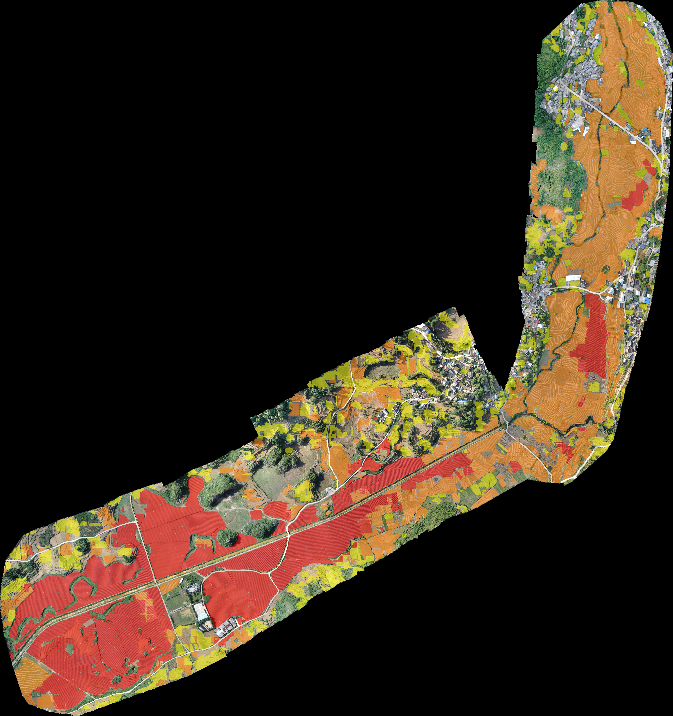
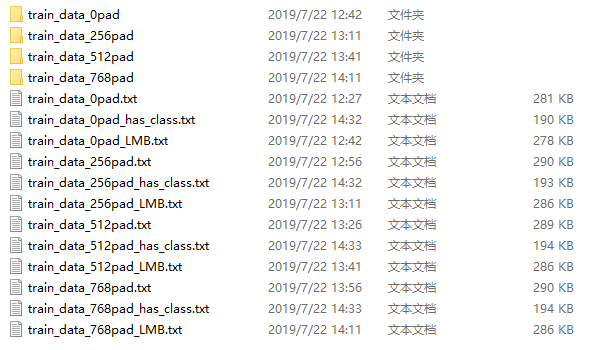
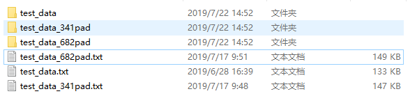

# 2019 年县域农业大脑AI挑战赛

阿里云天池大赛：https://tianchi.aliyun.com/competition/entrance/231717/introduction?spm=5176.12281925.0.0.6d767137aFNp4M

使用基于Python 3, Keras, TensorFlow的深度学习神经网络[Mask R-CNN](https://arxiv.org/abs/1703.06870) 模型，对每个图片生成bounding boxes和segmentation masks进行预测。本模型基于Feature Pyramid Network (FPN) 和ResNet101的模型骨架。

### *模型预测图例*


## 目录：
* code环境安装
* 数据处理
* 模型的建立和训练
* 预测和提交

## code环境安装

### Cuda&Cudnn
1. Cuda8.0+Cudnn6.0，用以匹配tensorflow1.4.0

### mask-rcnn环境安装
以下为mask-rcnn的安装，所需文件均在./code/Mask_RCNN-master内。
如安装有问题，亦可参考 https://github.com/matterport/Mask_RCNN

1. python>=3.4
2. 安装环境API库
   ```bash ./code/mask_rcnn_env_install.sh```
3. 下载pre-trained COCO weights (mask_rcnn_coco.h5) ，[下载地址](https://github.com/matterport/Mask_RCNN/releases), 将下载文件保存为 ```./code/mask_rcnn_coco.h5```

### 其他环境安装
1. 安装其他环境的API库
   ```bash ./code/other_env_install.sh```

## 数据处理
1. 执行数据处理命令 ```bash ./code/data_process.sh```
2. 确认文件已生成<br>



## 模型的建立和训练
1. 执行模型的建立和训练命令 ```bash ./code/train_MaskRCNN.sh```
2. 训练日志参考：

Epoch 33/38
1000/1000 [==============================] - 1533s 2s/step - loss: 1.5319 - rpn_class_loss: 0.0523 - rpn_bbox_loss: 0.5291 - mrcnn_class_loss: 0.1331 - mrcnn_bbox_loss: 0.3835 - mrcnn_mask_loss: 0.4340 - val_loss: 1.5329 - val_rpn_class_loss: 0.0274 - val_rpn_bbox_loss: 0.6689 - val_mrcnn_class_loss: 0.1235 - val_mrcnn_bbox_loss: 0.3438 - val_mrcnn_mask_loss: 0.3693<br>
Epoch 34/38
1000/1000 [==============================] - 1492s 1s/step - loss: 1.4445 - rpn_class_loss: 0.0475 - rpn_bbox_loss: 0.4600 - mrcnn_class_loss: 0.1341 - mrcnn_bbox_loss: 0.3731 - mrcnn_mask_loss: 0.4298 - val_loss: 1.2444 - val_rpn_class_loss: 0.0215 - val_rpn_bbox_loss: 0.4601 - val_mrcnn_class_loss: 0.0933 - val_mrcnn_bbox_loss: 0.3071 - val_mrcnn_mask_loss: 0.3623<br>
Epoch 35/38
1000/1000 [==============================] - 1479s 1s/step - loss: 1.4661 - rpn_class_loss: 0.0538 - rpn_bbox_loss: 0.4877 - mrcnn_class_loss: 0.1363 - mrcnn_bbox_loss: 0.3625 - mrcnn_mask_loss: 0.4257 - val_loss: 1.2783 - val_rpn_class_loss: 0.0271 - val_rpn_bbox_loss: 0.4771 - val_mrcnn_class_loss: 0.1084 - val_mrcnn_bbox_loss: 0.3165 - val_mrcnn_mask_loss: 0.3492<br>
Epoch 36/38
1000/1000 [==============================] - 1476s 1s/step - loss: 1.4421 - rpn_class_loss: 0.0467 - rpn_bbox_loss: 0.4779 - mrcnn_class_loss: 0.1282 - mrcnn_bbox_loss: 0.3632 - mrcnn_mask_loss: 0.4262 - val_loss: 1.4592 - val_rpn_class_loss: 0.0246 - val_rpn_bbox_loss: 0.6028 - val_mrcnn_class_loss: 0.1304 - val_mrcnn_bbox_loss: 0.3244 - val_mrcnn_mask_loss: 0.3770<br>
Epoch 37/38
1000/1000 [==============================] - 1480s 1s/step - loss: 1.4381 - rpn_class_loss: 0.0509 - rpn_bbox_loss: 0.4871 - mrcnn_class_loss: 0.1258 - mrcnn_bbox_loss: 0.3513 - mrcnn_mask_loss: 0.4231 - val_loss: 1.3069 - val_rpn_class_loss: 0.0415 - val_rpn_bbox_loss: 0.5385 - val_mrcnn_class_loss: 0.1045 - val_mrcnn_bbox_loss: 0.3045 - val_mrcnn_mask_loss: 0.3179<br>
Epoch 38/38
1000/1000 [==============================] - 1474s 1s/step - loss: 1.4225 - rpn_class_loss: 0.0466 - rpn_bbox_loss: 0.4718 - mrcnn_class_loss: 0.1197 - mrcnn_bbox_loss: 0.3637 - mrcnn_mask_loss: 0.4207 - val_loss: 1.2544 - val_rpn_class_loss: 0.0202 - val_rpn_bbox_loss: 0.4512 - val_mrcnn_class_loss: 0.1070 - val_mrcnn_bbox_loss: 0.3167 - val_mrcnn_mask_loss: 0.3594<br>

## 预测和提交
1. 执行模型的建立和训练命令 ```bash ./code/merge_submit.sh```
2. 确认文件已生成<br>

